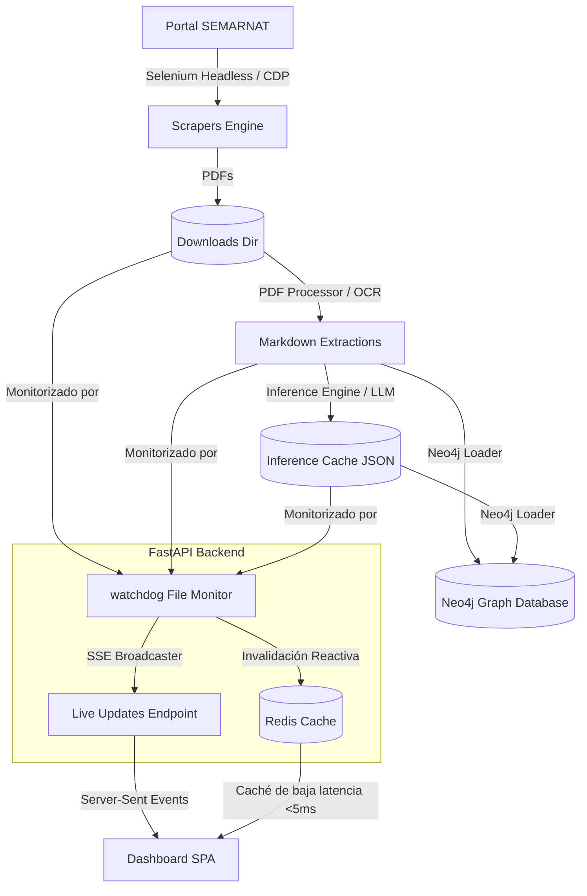

# Zohar Intelligence v4 🌌

> Plataforma inteligente y reactiva para el procesamiento masivo de Gacetas Ecológicas de la SEMARNAT, extracción semántica de entidades y modelado en grafos de conocimiento.

Zohar v4 es una aplicación de datos intensiva diseñada bajo criterios de alta disponibilidad, concurrencia no bloqueante y sincronización en tiempo real. Combina scrapers inteligentes basados en navegadores headless, procesamiento híbrido de PDFs (OCR/Markdown), inferencia analítica de viabilidad ambiental (LLM) y persistencia en grafos a través de Neo4j.

---

## 🏛️ Arquitectura del Sistema

El ecosistema se distribuye en tres capas principales que garantizan un procesamiento asíncrono y de baja latencia:



### Componentes de Software:
1.  **FastAPI Backend (`api/main.py`)**: API unificada que sirve endpoints SSE, gestiona el flujo de consultas, expone endpoints de análisis e interactúa con Redis y bases de datos.
2.  **SPA Dashboard (`dashboard/`)**: Panel de control interactivo construido con HTML5, CSS3 personalizado (Glassmorphism) y Javascript nativo, suscrito a eventos en tiempo real.
3.  **Engine de Descargas (`scrapers/semarnat_downloader.py`)**: Downloader basado en Selenium configurado para interactuar con la SPA Angular de SEMARNAT. Incluye fallback CDP para interceptar descargas directas de PDFs.
4.  **Cargador de Grafos (`dw/neo4j_loader.py`)**: Cargador masivo de entidades que estructura gacetas, proyectos, estados y tipos de MIA en relaciones semánticas.
5.  **Entorno de Contenedores (`dw/docker-compose.yml`)**: Orquesta las bases de datos (PostgreSQL/PostGIS, Neo4j) y el bus de datos en memoria (Redis).

---

## 🚀 Guía de Inicio Rápido

### Prerrequisitos
Asegúrate de contar con los siguientes elementos instalados en el sistema host:
- Docker y Docker Compose
- Python 3.11+
- Google Chrome (para Selenium Headless en el host)

### 1. Inicializar la Infraestructura (Bases de Datos + Redis)
Levanta los servicios de docker desde el directorio `dw/`:
```bash
cd dw/
docker compose up -d
```
Esto encenderá:
- **PostgreSQL/PostGIS** (Puerto `5432`)
- **Redis** (Puerto `6379`)
- **Neo4j Browser** (Puerto `7474` HTTP / `7687` Bolt)

### 2. Configurar el Entorno Virtual Python
Desde la raíz del proyecto:
```bash
python3 -m venv .venv
source .venv/bin/activate
pip install -r requirements.txt
```

### 3. Ejecutar y Controlar el Servidor en Producción (Systemd)
El servidor FastAPI se administra de forma persistente a nivel de usuario en Systemd.

- **Verificar estado del servicio**:
  ```bash
  systemctl --user status zohar-server.service
  ```
- **Reiniciar el servidor (Redeploy)**:
  ```bash
  systemctl --user restart zohar-server.service
  ```
- **Ver logs en tiempo real**:
  ```bash
  journalctl --user -u zohar-server.service -f
  ```

---

## 🔄 Flujo de Trabajo (Ingesta de Datos Paso a Paso)

El procesamiento de una clave SINAT o Bitácora sigue este orden secuencial:

### Paso 1: Descarga del Documento
El scraper recibe la clave y realiza la consulta en la SPA de SEMARNAT:
```python
# Ejemplo de consumo de scraper
from scrapers.semarnat_downloader import SemarnatDownloader
downloader = SemarnatDownloader()
downloader.descargar_clave("23QR2025T0061")
```
*   **Mecanismo**: El robot simula la escritura en el input Angular, hace clic en "Buscar", espera la carga de resultados y descarga los PDFs de Estudio, Resumen y Resolutivo a `downloads/`.
*   **CDP Fallback**: Si el clic falla por superposición de capas en el portal, el motor lee el log de red de Chrome DevTools Protocol, intercepta las URLs de los PDFs y los descarga directamente con `requests`.

### Paso 2: Conversión a Markdown (OCR)
Los PDFs en `downloads/` se parsean y se extrae el texto semiestructurado a formato Markdown en `extractions/`.
```bash
# Correr pipeline de conversión
python dw/pipeline.py
```

### Paso 3: Inferencia de Viabilidad AI
El motor de inferencia procesa las gacetas Markdown buscando condicionantes, violaciones de áreas naturales protegidas y señales críticas ("knockouts"), guardando el resultado en `data/inference_cache/{clave}.json`.

### Paso 4: Carga al Grafo de Entidades (Neo4j)
Carga todas las claves en disco directamente a la base de datos de grafos:
```bash
python dw/neo4j_loader.py --clear
```
Abre tu navegador en [http://localhost:7474](http://localhost:7474) (Credenciales por defecto: `neo4j` / `zohardev2024`) y visualiza las relaciones con la consulta:
```cypher
MATCH (p:Proyecto)-[r]->(n) RETURN p, r, n LIMIT 100
```

---

## ⚡ Rendimiento, Caché e Instant Updates

### Live Updates (Watchdog + SSE)
Zohar v4 monitoriza continuamente el almacenamiento. Cuando el backend escribe un nuevo PDF en `downloads/` o un reporte en `inference_cache/`:
1.  El watcher de `watchdog` intercepta el evento de creación/modificación.
2.  Invalida inmediatamente las llaves correspondientes en **Redis**.
3.  El `LiveUpdateBroadcaster` envía un Server-Sent Event (SSE) al dashboard mediante `/api/events/live-updates`.
4.  El dashboard actualiza de forma reactiva las tablas de datos **sin que el usuario deba presionar F5**.

### Concurrencia No Bloqueante
Todas las operaciones I/O bloqueantes (lecturas de archivos MD de múltiples páginas, escaneos recursively de discos, y llamadas externas) se procesan en pools de hilos dedicados mediante `asyncio.to_thread`. Esto asegura que el hilo del event loop de FastAPI permanezca libre para responder peticiones HTTP con latencias mínimas.

### Estrategia de Caché Redis
Las llaves gestionadas en el servidor Redis local son:
-   `zohar:corpus:pdfs` (TTL 30m): Caché de listado de PDFs con metadata.
-   `zohar:graph:compact` (TTL 24h): Grafo optimizado de D3.js.
-   `zohar:analytics:summary` (TTL 5m): Resumen cuantitativo de carpetas de ingesta.
