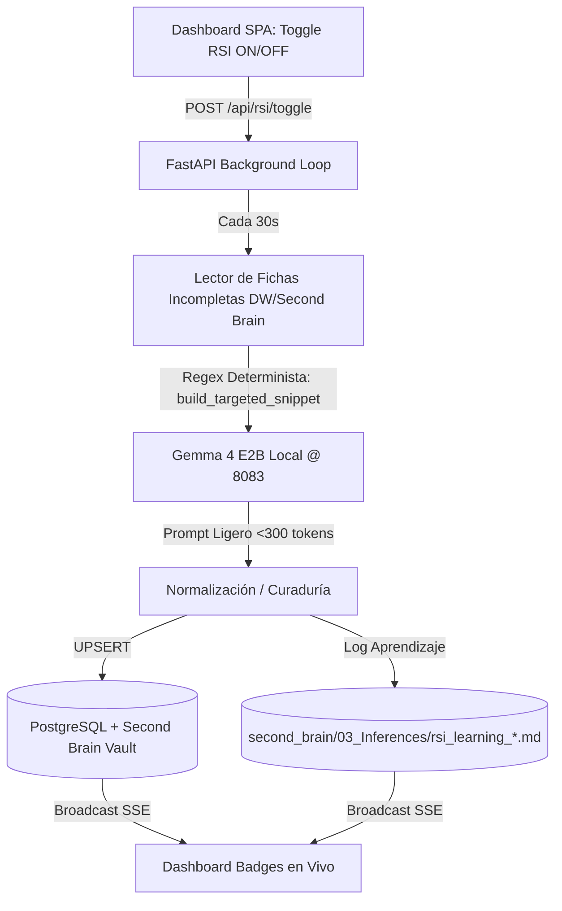

# Plan de Implementación — RSI Atómico en Dashboard, Contratos de Etapa & Curaduría Determinista 🌌

> **Estado**: **COMPLETADO E INTEGRADO EN MAIN** ✅  
> Todos los componentes de la auto-curaduría atómica, la matriz de contratos, la extracción determinista por snippet y la cuarentena de PDFs corruptos han sido implementados, probados (61 passed) y subidos a GitHub.

---

## 🏛️ Arquitectura de la Operación Atómica de RSI

---

## Componentes Implementados

### Componente 1: Motor Backend de RSI Atómico (`api/` & `core/`)

#### [COMPLETADO] [core/rsi_brain.py](file:///home/gorops/proyectos%20antigravity/zohar-v4-main/core/rsi_brain.py) & [core/text_utils.py](file:///home/gorops/proyectos%20antigravity/zohar-v4-main/core/text_utils.py)
- `run_atomic_metadata_curation_step()` implementado y optimizado con consulta resiliente a Postgres (`LIMIT 30`) para omitir registros sin archivo fuente descargado.
- `build_targeted_snippet()` en `core/text_utils.py` utiliza regex determinista con palabras clave (`promovente`, `solicitante`, `razón social`, `municipio de`, etc.) y catálogo de los 32 estados de México.

#### [COMPLETADO] [api/main.py](file:///home/gorops/proyectos%20antigravity/zohar-v4-main/api/main.py)
- Endpoints de control `/api/rsi/toggle-status` y `/api/rsi/toggle`.
- Worker `_atomic_rsi_worker_loop()` activo con notificación SSE en vivo (`live_broadcaster`).

---

### Componente 2: Matriz de Contratos de Etapa & Auto-Healing (`core/`)

#### [COMPLETADO] [core/stage_contracts.py](file:///home/gorops/proyectos%20antigravity/zohar-v4-main/core/stage_contracts.py)
- Verificadores de contrato para Ingesta DOM, OCR/Markdown, Persistencia DW, Vault Second Brain e Inferencia LLM.

---

### Componente 3: Toggle UI en el Dashboard (`dashboard/`)

#### [COMPLETADO] [dashboard/index.html](file:///home/gorops/proyectos%20antigravity/zohar-v4-main/dashboard/index.html) & [dashboard/static/app.js](file:///home/gorops/proyectos%20antigravity/zohar-v4-main/dashboard/static/app.js)
- Switch "RSI Auto-Curaduría" integrado en la barra superior.
- Escucha SSE para actualización automática de contadores y badges.

---

### Componente 4: Robustez Batch & Cuarentena (`core/`)

#### [COMPLETADO] [core/pdf_summarizer.py](file:///home/gorops/proyectos%20antigravity/zohar-v4-main/core/pdf_summarizer.py)
- Migración de Map-Reduce a Single-Pass en las primeras páginas.
- Manejo de excepciones en el batch con aislamiento automático de PDFs corruptos hacia la carpeta `_corruptos/`.

---

## Verificación

- Suite completa ejecutada: **61 passed, 2 deselected**.
- Pruebas dedicadas: `tests/test_atomic_rsi_and_contracts.py` y `tests/test_text_utils.py`.
- Commits subidos a `origin/main` en GitHub.
