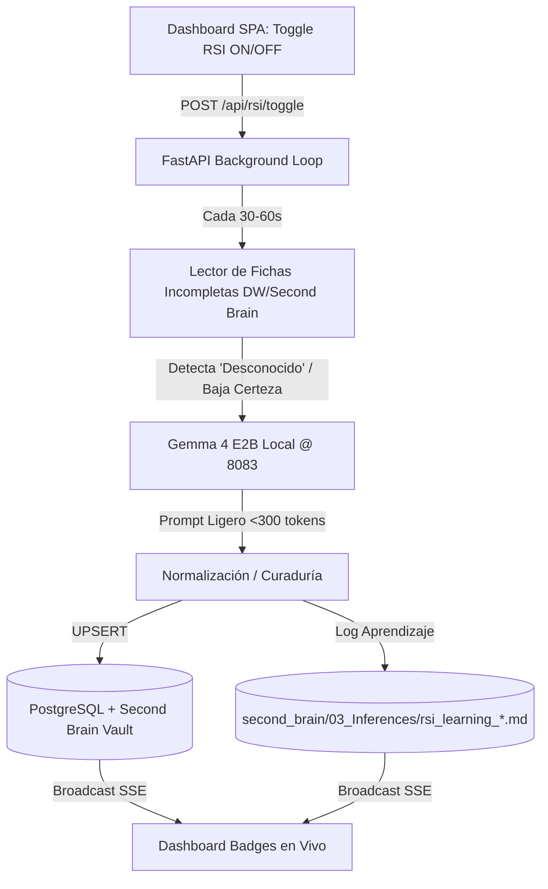

# Plan de Implementación — RSI Atómico en Dashboard & Contratos de Etapa End-to-End 🌌

Este plan detalla la integración del **Toggle de Auto-Curaduría RSI Atómica** en el Dashboard SPA y la **Matriz de Validación por Contrato de Etapa** con Auto-Healing.

---

## 🏛️ Arquitectura de la Operación Atómica de RSI



---

## Proposed Changes

### Componente 1: Motor Backend de RSI Atómico (`api/` & `core/`)

#### [MODIFY] [core/rsi_brain.py](file:///home/gorops/proyectos%20antigravity/zohar-v4-main/core/rsi_brain.py)
- Añadir la función `run_atomic_metadata_curation_step()`:
  1. Busca 1 proyecto en la base de datos o en el Second Brain que contenga valores por defecto (`Desconocido`, `General`, `PENDIENTE`).
  2. Carga los primeros párrafos del estudio/resumen extraído.
  3. Realiza la inferencia ultraligera con Gemma 4 E2B (`llm_client.py`).
  4. Actualiza PostgreSQL (`semarnat_projects`) y regenera la nota Markdown del proyecto.
  5. Escribe la lección aprendida en `second_brain/03_Inferences/rsi_learning_curation.md`.

#### [MODIFY] [api/main.py](file:///home/gorops/proyectos%20antigravity/zohar-v4-main/api/main.py)
- Añadir endpoints de control para el Toggle del Dashboard:
  - `GET /api/rsi/toggle-status`: Devuelve si la auto-curaduría atómica está activa.
  - `POST /api/rsi/toggle`: Activa o desactiva la tarea en segundo plano.
- Integrar el bucle `asyncio` background worker para la auto-curaduría atómica.

---

### Componente 2: Matriz de Contratos de Etapa & Auto-Healing (`core/`)

#### [NEW] [core/stage_contracts.py](file:///home/gorops/proyectos%20antigravity/zohar-v4-main/core/stage_contracts.py)
- Definir verificadores de contrato para cada etapa de la cadena:
  - **Etapa 1 (Ingesta DOM):** `validate_ingested_clave(clave, files)` -> bool
  - **Etapa 2 (OCR/Markdown):** `validate_markdown_extraction(md_path)` -> bool
  - **Etapa 3 (DW Persistence):** `validate_dw_record(clave)` -> bool
  - **Etapa 4 (Second Brain):** `validate_vault_note(clave)` -> bool
  - **Etapa 5 (Inferencia LLM):** `validate_inference_report(clave)` -> bool
- Si una etapa falla, se registra la anomalía y se encola para auto-healing en la siguiente iteración RSI.

---

### Componente 3: Toggle UI en el Dashboard Glassmorphism (`dashboard/`)

#### [MODIFY] [dashboard/index.html](file:///home/gorops/proyectos%20antigravity/zohar-v4-main/dashboard/index.html)
- Agregar el switch/toggle **"RSI Auto-Curaduría"** en la barra superior de control del Dashboard con indicador de pulso en vivo.

#### [MODIFY] [dashboard/static/app.js](file:///home/gorops/proyectos%20antigravity/zohar-v4-main/dashboard/static/app.js)
- Vincular la interacción del Toggle con `POST /api/rsi/toggle`.
- Escuchar eventos SSE de curaduría atómica para actualizar dinámicamente el contador de "Fichas Curadas" y badges en pantalla.

---

## Verification Plan

### Automated Tests
- Crear suite de prueba para la curaduría atómica y validación de contratos:
  ```bash
  .venv/bin/pytest tests/test_atomic_rsi_and_contracts.py -v
  ```

### Manual Verification
1. Iniciar el servidor con `./start_server.sh`.
2. Activar el Toggle **"RSI Auto-Curaduría"** desde el Dashboard.
3. Observar los logs en tiempo real SSE y la auto-corrección de fichas con campos "Desconocido".
4. Verificar la creación de lecciones aprendidas en `second_brain/03_Inferences/rsi_learning_curation.md`.
